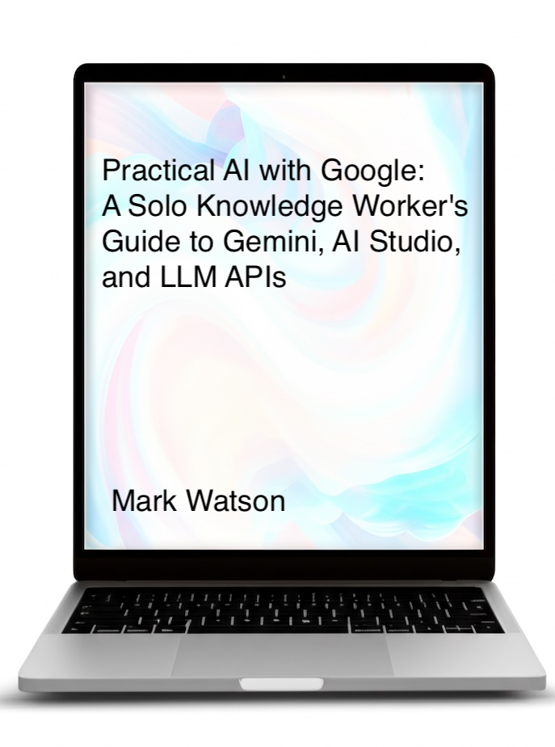

# Practical AI with Google: A Solo Knowledge Worker's Guide to Gemini, AI Studio, and LLM APIs

**by Mark Watson**

This book is written for solo knowledge workers who use the Google AI Platform. It covers practical techniques for leveraging AI tools effectively in your work and research — whether you're a freelance creative, small business owner, solo software developer, independent marketing professional, general consultant, or independent researcher.

## Topics Covered

- Practical general tips for being an effective solo knowledge worker
- **Gemini** — Google's AI assistant for non-programming workflows
- **NotebookLM** — Google's platform for research and study
- **Google AI Studio** — experimenting with new AI models, software prototyping, and using models for video and image generation
- **Python programming** — writing short Python programs to use the Google AI platform (optional, for developers)
- **Gemini CLI** — command-line AI agent workflows
- **Google Agent Toolkit** — building AI agents with Google's tools

## Get the Book

📖 **Read free online on Leanpub:** [https://leanpub.com/read/solo-ai](https://leanpub.com/read/solo-ai)

## Source Code

The `source-code/` directory contains working examples for the programming chapters, including:

- Google API authentication and setup
- Gemini thinking / reasoning examples
- Image and text processing with Gemini
- Knowledge graphs
- Google Workspace app integrations (Gmail, Calendar, etc.)
- Google Agent Toolkit examples

## Author

Mark Watson has been involved in commercial AI development since the 1980s, delivering AI systems for organizations including Capital One, Google, SAIC, DARPA, Olive AI, and others. He holds 55 US patents and has written over 20 books on AI.

See all of Mark's books at [https://leanpub.com/u/markwatson](https://leanpub.com/u/markwatson).
