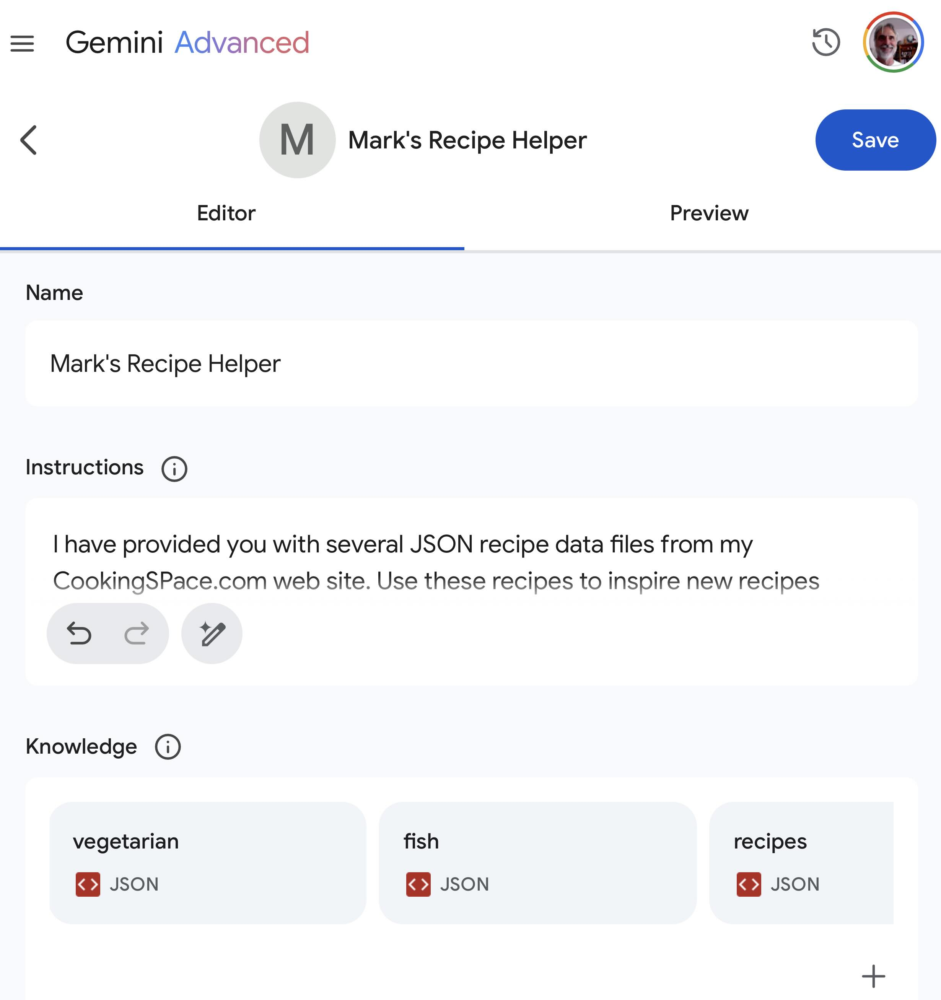
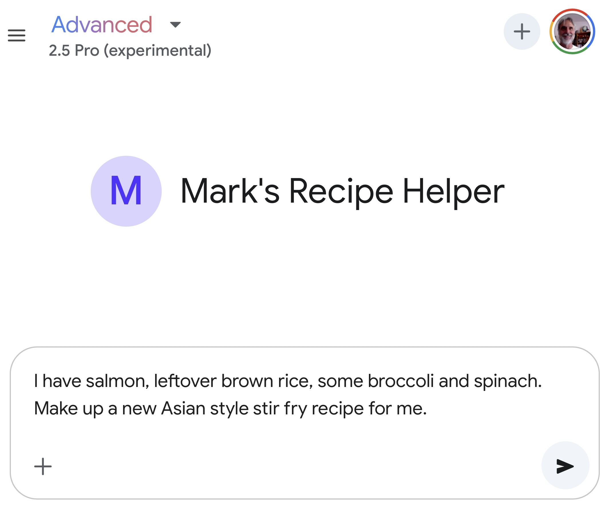

# Google's AI Ecosystem

The chapter serves as an introduction to tools we will use repeatedly in many examples.

The Google AI ecosystem offers a diverse range of tools, from user-friendly applications integrated into daily workflows to powerful cloud-based platforms and APIs. For the solo knowledge worker, navigating this landscape requires focusing on tools that are realistically accessible, useful for individual or very small team contexts, and considerate of potential budget and technical expertise limitations.

## Differences Between AI Support in Paid For Google Workspace and Free Apps Like Gmail, Calendar, and Docs.

The integration of AI capabilities, primarily through Gemini, differs significantly between the paid Google Workspace platform and the suite of free Google applications (Gmail, Calendar, Docs, Drive, etc.) accessible with a standard Google account. The core distinction lies in the depth and nature of this integration, impacting user workflow and the scope of AI assistance.

Gemini’s integration is deeper in the commercial Workspace product because it functions as a co-pilot when dealing with workflows across Workspace apps.  Gemini operates within the application you're using. When drafting in Docs, it can help write, summarize, or change the tone based on the existing document content. In Gmail, it can draft replies aware of the email thread's context. In Sheets, it can help generate formulas or analyze data present in the sheet.

For users of the free Google apps, Gemini integration operates differently. It's not typically embedded directly within the free versions of Docs, Sheets, or standard Gmail in the same co-pilot manner. Instead, the interaction primarily occurs:

- Through the Gemini App/Web Interface: Users interact with Gemini via its dedicated mobile apps (Android/iOS) or the web interface (gemini.google.com).
- Via Extensions/Connections: To allow Gemini to access data from free apps like Gmail, Drive, or Calendar, users must explicitly enable specific "Extensions" or connections within the Gemini settings. This grants Gemini permission to query that data.
- Querying and Summarization: The focus is more on using Gemini as a central hub to ask questions about or summarize information from your connected services. For example, you can ask Gemini to "summarize my recent emails from John Doe," "find the document titled 'Project Phoenix proposal'," or "what's on my calendar tomorrow?".
- Less Integrated Workflow: While Gemini can access this data, the workflow is less seamless. You generally need to switch from your primary application (e.g., Gmail) to the Gemini interface to invoke its capabilities regarding that application's data. While it might help draft a basic email from the Gemini interface, it doesn't offer the same level of contextual, in-app writing assistance as the Workspace version.

When I work for corporate customers I use their WorkSpace instantiation but I have never used it for an extended period of time for my own workflow. One feature of WorkSpace is the **Cloud Search** application that searches across all your data in Google apps and Google Drive: very convenient!

## Conversational AI Using the Gemini App and Web App

Gemini serves as a versatile conversational AI assistant, capable of understanding and generating human-like text, engaging in dialogue, summarizing information, translating languages, writing different kinds of creative content, and generating software code.

### Configuring Gemini Advanced Web App

*Note: I use Gemini Advanced but most examples in this book also work with the free version of Gemini.*

After logging into [https://gemini.google.com/](https://gemini.google.com/) use the menu in the upper let hand corner (looks like three horizontal lines: the “hamburger” icon) to expand the menu and select **Settings** (last menu item at the bottom) and then elect the **Apps** submenu. You can now connect Gemini to the Google apps that you want to grant Gemini access to. For work I connect all Google Workspace apps (Gmail, Calendar, Docs, Drive, Keep, and Tasks). For fun and personal use I also connect Google Flights and Hotels, as well as Google Maps, YouTube, and YouTube Music (which I use). Optionally connect to OpenStax to get access to licenses textbooks.

### Ask Gemini Chat

I use Gemini Chat fairly much interchangeably with OpenAI’s ChatGPT and Anthropic’s Claude with one life hack: I usually only pay for one service at a time. As I write this in April 2025, I subscribe to Gemini Advanced and use Claude and ChatGPT in the free mode. Assuming that you subscribe to Gemini Advanced here are the current models to choose from:


I usually select Gemini Flash 2.0 for general use because it is fastest and uses less resources (if you care about energy efficiency and the environment; if you want good background on the costs of AI then I recommend reading Kate Crawford’s book **Atlas of AI**.)

You have four easily used options in the chat input as seen in this figure:


The options are:

- **+** - hit the plus sign to add files to your current context window. For example, if I have a PDF file for a textbook, I will import the book’s PDF before asking questions about the content of the book. You can add several context files.
- **Deep Research** - useful when you want Gemini to perform a thorough web search, choose which search hits are useful, and add the search results to the context before spending reasoning time answering your question or prompt.
- **Canvas** - is useful for creating documents and software code that can later be downloaded to your computer.
- **Microphone** - hit the icon that looks like a microphone to enter prompt text with voice input. If you are in a private work place, this is the option I recommend starting with, then hand edit dictated prompt text.

### Using the macOS Gemini App

If you run on Macs then I recommend that you download the Gemini App. Here is a screenshot of it:


Functionally this app is equivalent to running the web app v on the Chrome or Safari web browsers.

### Advice On Writing LLM Prompts

Google's Gemini represents a family of sophisticated large language models (LLMs) engineered with powerful multimodal capabilities, capable of processing and understanding not just text, but also image, audio, and video inputs. You can drop image files, text, files containing software, and PDFs int the Gemini chat window and this data supplies context for any text chats and prompts you then manually enter.

You engage with advanced AI systems like Gemini through various interfaces, including web applications and mobile apps, primarily by providing 'prompts'. These prompts, which can range from simple text questions to complex instructions involving uploaded files or even spoken commands, serve as the fundamental mechanism for directing Gemini's behavior and eliciting specific responses, guiding the AI to perform tasks like generating text, analyzing data, creating code, or answering questions based on the provided input.   

The practice of crafting these inputs effectively is known as prompt engineering or prompt writing. It is often described as both an art and a science, requiring a blend of creativity, linguistic precision, and an understanding of how LLMs like Gemini interpret instructions and generate outputs. At its core, prompt writing is the skill of communicating intent clearly to the AI, guiding it to leverage its vast knowledge and capabilities in the desired direction while navigating its inherent limitations. It bridges the gap between human intention and the AI's operational logic, enabling more controlled and predictable interactions.   

Effective prompt writing hinges on several key principles designed to maximize the clarity and relevance of the AI's response. Central among these are clarity and specificity, ensuring instructions are unambiguous and detailed enough for the model to understand the exact task. Providing sufficient context is also crucial, giving Gemini the necessary background information to frame its response appropriately. Furthermore, defining the desired output format (e.g., bullet points, email, code block) and tone (e.g., formal, conversational, humorous) helps shape the final result to meet specific needs. Techniques like including examples (few-shot prompting) can further refine the output. Examples are important, for example, when asking Gemini to pull structured data from input text to formats like JSON.

Mastering the art of prompt writing is paramount for unlocking the full potential and utility of powerful AI models like Gemini. Well-crafted prompts lead directly to higher-quality, more accurate, and significantly more useful responses, minimizing generic or irrelevant outputs. This skill translates into tangible benefits such as enhanced productivity, accelerated workflows, improved decision-making, and the ability to leverage Gemini for more complex creative and analytical tasks. Ultimately, skillful prompt writing transforms the interaction with Gemini from simple querying into a powerful collaboration, allowing users to harness its advanced capabilities more effectively and reliably.

### Creating Gemini Gems

Gemini Gems are essentially customized versions of the Gemini AI assistant that you can create and save for specific purposes. You create Gems using the **Gem manager** menu option.  The Gem manager screen shows **Premade by Google** gems that I suggest you explore for ideas. After you create your own Gems, they appear at the bottom of the Gem manager screen. We will create a new gem after some background:

Think of Gems as specialized "experts" or focused tools built upon the core Gemini model. You define a Gem by providing it with a specific set of instructions, outlining its persona, the task it should perform, the context it needs to consider, and potentially the format for its responses. You can further enhance a Gem's capabilities by providing it with knowledge files, such as uploaded documents or files from your Google Drive, which it can reference to inform its answers and maintain consistency with your specific information or guidelines.

The primary reasons for creating and using Gems revolve around efficiency, personalization, and consistency. By saving detailed instructions within a Gem, you avoid repeatedly typing complex prompts for recurring tasks, saving significant time and effort. This allows you to tailor Gemini's behavior precisely to your needs – whether you require a specific writing tone, adherence to particular coding standards, consideration of dietary restrictions for recipes, or knowledge about a niche topic. Using Gems ensures that Gemini consistently follows your predefined guidelines or consults specific documents every time you interact with that particular Gem, leading to more reliable and relevant outputs for specialized tasks.

Examples of Gems are quite varied, reflecting the flexibility of the concept. You could create a "Coding Partner" Gem instructed on your preferred programming languages and project context, potentially referencing specific code libraries. A "Marketing Copywriter" Gem could be built using your company's brand voice guidelines and target audience details stored in uploaded documents. For personal use, you might design a "Meal Planner" Gem that knows your dietary preferences and budget, a "Workout Generator" Gem aware of your fitness goals and limitations, or a "Brainstorming Assistant" Gem configured to encourage creative, out-of-the-box thinking for your specific projects or hobbies.


#### Creating a Gem for Suggesting Recipes Given the Context of Some Favorite Recipes

I will run through this example step by step. Click on the **+ New Gem** button. Here I create a new Gem by dropping three JSON recipe files from my CookingSpace.com project into the **Knowledge** input form at the bottom of the screen, name the gem, and provide instructions.

Writing new Gems is simple, so if you repeatedly run similar prompts, then by all means customize and personalize Gemini by creating your own Gems!

Here are a few screenshots showing creating and use of a new Gem:



OK, we have a new Gem, let’s use it:



Here is a slightly edited (for brevity) output for the prompt:

```text
I have salmon, leftover brown rice, some broccoli and spinach. Make up a new Asian style stir fry recipe for me.
```

Here is the generated recipe:

```text
Here's a recipe idea for Quick Salmon & Veggie Stir-Fried Rice:

Yields: 1-2 servings
Prep time: 10 minutes
Cook time: 10-15 minutes

Ingredients:

- Salmon: 1 fillet (about 6 oz), skin removed and cut into 1-inch cubes
- Broccoli: 1 cup, cut into small florets (similar to Salmon Rice or Lemon Sesame Broccoli)
- Spinach: 1-2 cups, fresh
- Leftover Cooked Brown Rice: 1.5 - 2 cups (like in Salmon Rice or Simple Shrimp Fried Rice)
- Garlic: 1-2 cloves, minced (inspired by multiple recipes like Spicy Shrimp with Vegetables and Rice)
- Ginger: 1 teaspoon, freshly grated (optional, inspired by Simple Shrimp Fried Rice)
- Soy Sauce: 2 tablespoons (a common ingredient in Asian-style recipes provided)
- Sesame Oil: 1 tablespoon (used in Salmon Rice, Honey Chinese Shrimp, Simple Shrimp Fried Rice)
- Honey or Brown Sugar: 1 teaspoon (optional, for a touch of sweetness like in Honey Chinese Shrimp)
- Oil for cooking: 1-2 tablespoons (e.g., vegetable, canola, or olive oil, as seen in various recipes)
- Optional: Red pepper flakes (like in Spicy Shrimp with Vegetables and Rice or Marinara Sauce), sliced green onions for garnish.

Directions:

Prepare the Sauce: In a small bowl, whisk together the soy sauce, sesame oil, and optional honey/brown sugar and red pepper flakes. Set aside.

Sauté Aromatics & Broccoli: Heat 1 tablespoon of cooking oil in a large skillet or wok over medium-high heat. Add the minced garlic and grated ginger (if using) and stir-fry for about 30 seconds until fragrant. Add the broccoli florets and stir-fry for 3-4 minutes until crisp-tender.

Cook Salmon: Push the broccoli to one side of the skillet. Add the cubed salmon to the empty side. Cook for 2-3 minutes per side, until opaque and cooked through. Try not to break the pieces up too much.

Add Rice & Spinach: Add the leftover brown rice to the skillet, breaking up any clumps. Stir-fry for 2-3 minutes until heated through. Add the spinach and stir until it begins to wilt (about 1-2 minutes).

Combine & Sauce: Gently toss the salmon, broccoli, rice, and spinach together. Pour the prepared sauce over everything and toss gently to coat evenly. Cook for another minute.

Serve: Serve immediately, garnished with sliced green onions if desired.

Enjoy your quick and healthy Asian-style stir fry!
```

It took me one minute to create this Gem and it is functional for generating new recipes.

Once Gems are written, try using them and then keep improving them! After I wrote this section I went back to edit my Recipe Gem, adding all eight JSON recipe files from my old recipes project so it has a broader context to suggest new and novel recipes that I might like.

#### Ideas For Your Own Gems

What, dear reader, do you do for a living and what are your hobbies? I suggest that you start with a fresh sheet of paper (or an empty note file on your computer) and write down three or four of your interests. For each or your interests, write down what data you have for each interest. It is better if the data is something that you produced yourself so the Gems that you create will generate text, audio, images, and videos in your own personal style.

Let’s look at an example use case:

Most of the books that I write are tech-heavy with many programming examples. I very much enjoy both programming and writing but there is one task that I do not enjoy: when I place a software listing in one of my books I need to add several paragraphs describing the code, what libraries I used in the code, etc. This is tedious so I automated this process two years ago with a custom ChatGPT and more recently I automated it once again using Gemini: I collected many examples in my older books of my program listings followed by the explanatory text I wrote myself. Now I can use my Gemini Gem called “Mark Watson Writing Assistant” and drop in any new program listing I have created and I get several paragraphs of explanatory text that I can edit and tweak, and then insert into my manuscript.

I believe that the more effort you put into personalizing AI tools, the more benefit you get.

## Google NotebookLM

NotebookLM notebooks in a similar way as custom Gemini Gems, with a few differences:

- I use NotebookLM notebooks when I want to study 3rd party technology (i.e., something that I did not create myself) to collect relevant documents and web sites to study in one place, with a Gemini chat interface for “taking about” this content.
- I use NotebookLM notebooks when I am starting a new writing or software development project to organize my thoughts and to “brainstorm” with Gemini, given as context the material in a notebook.

I tend to remove old notebooks when I am done with them. I find this to be analogous to how twenty years ago I used to organize new writing and also software projects with handwritten notes on yellow pads and spread the sheets of paper around. I would clean up the paper artifacts when a project is done, and I also like to keep my NotebookLM work environment tidy. Here is a screenshot of the notebooks that I am currently using:


Using the NotebookLM web app is straightforward and I will not discuss it further.

## Google AI Studio

Before starting to read this section, dear reader, please open the [Google AI Studio web app](https://aistudio.google.com/) and login with your Google (or Gmail) account. Google AI Studio is tailored to workflows for developers:

The fundamental distinction between the Google AI Studio (aistudio.google.com) and the Gemini web application (gemini.google.com) lies in their target audience and primary purpose: AI Studio is a web-based developer tool focused on prototyping and experimenting with Google's generative models via the Gemini API, whereas the Gemini web app is a direct-to-consumer application designed for general users to interact conversationally with the Gemini models for assistance, content generation, and information retrieval. While both interfaces ultimately leverage Google's powerful AI models like Gemini, AI Studio provides a structured environment specifically for developers and builders to craft, test, and refine prompts, adjust model parameters (like temperature, top-k, top-p), compare outputs from different prompt variations, and ultimately generate API keys and corresponding code snippets (in languages like Python, JavaScript, curl, etc.) to integrate the model's capabilities into their own applications or services. In contrast, the Gemini web app offers a more streamlined, conversational chat interface optimized for direct interaction, task completion, and creative exploration by end-users, without exposing the underlying API controls, parameter tuning, or explicit code generation features found in AI Studio; its focus is on the experience of using AI, while AI Studio's focus is on the process of building with the AI via its API.

Here is a screenshot of the web app:


This screenshot shows what you will see the first time you open the web app with one exception: on the lower left corned of the app window, under **History** you see a few of my exiting projects like “Hy playground”, Clojure Research agent, Prolog and LLMs, etc.

Google AI Studio serves as an accessible gateway to Google's powerful generative artificial intelligence models, most notably the Gemini family. It's a web-based platform designed for rapid experimentation and prototyping with AI. Whether you're looking to understand what modern AI can do, build a proof-of-concept for a new application, or simply explore creative possibilities, AI Studio provides an interactive environment to directly engage with sophisticated AI capabilities without complex setup requirements.

For developers, AI Studio is an invaluable tool for quickly iterating on prompts and tuning model parameters like temperature or top-k to achieve desired outputs before integration. You can craft and refine prompts for various tasks, test different model versions, and seamlessly generate API keys to embed the power of Gemini models directly into your own applications and workflows. This significantly accelerates the development cycle for AI-powered features, allowing for faster testing and deployment.

For marketing professionals, small business owners, and other non-technical users, AI Studio demystifies generative AI by providing an intuitive interface to explore its potential. You can experiment with generating creative text formats, brainstorming ideas, summarizing information, drafting communications, or even analyzing images, all through simple prompt interactions. This hands-on experience allows users to discover practical applications for AI within their specific business context or creative endeavors, fostering innovation without needing to write a single line of code.
