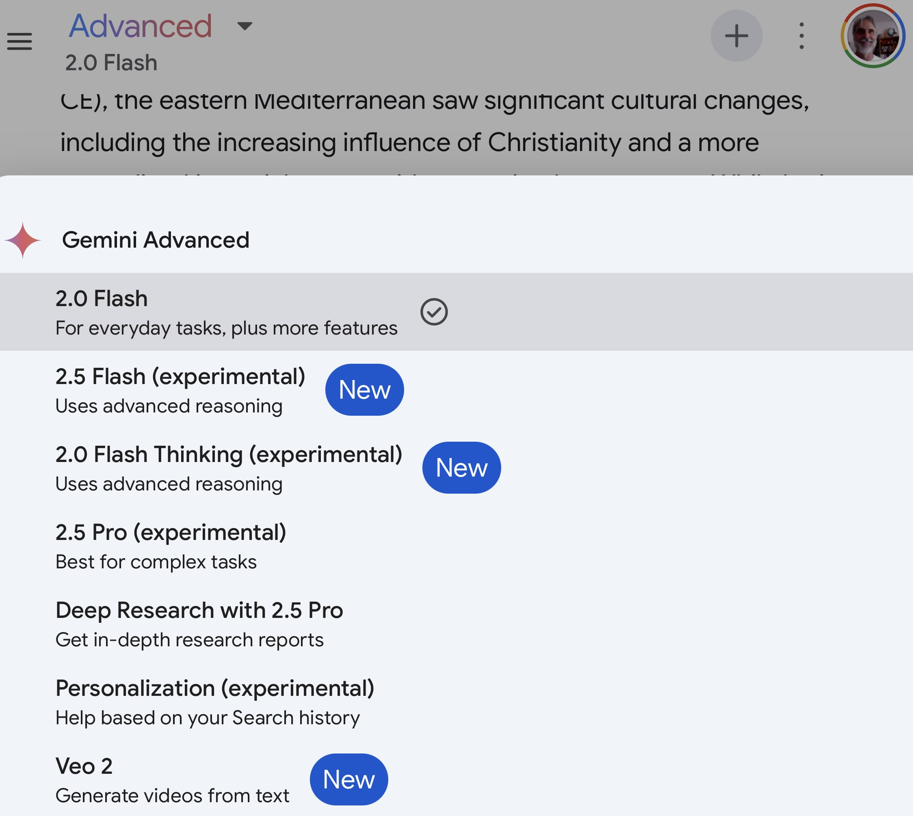
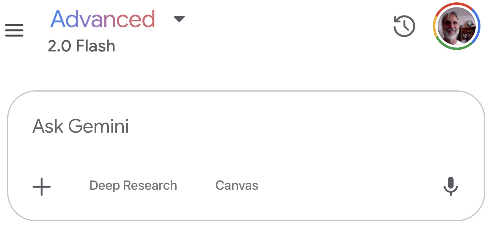
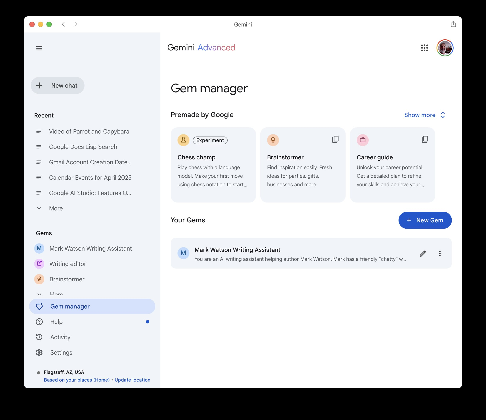

# Google's AI Ecosystem

The chapter serves as an introduction to tools we will use repeatedly in many examples.

The Google AI ecosystem offers a diverse range of tools, from user-friendly applications integrated into daily workflows to powerful cloud-based platforms and APIs. For the solo knowledge worker, navigating this landscape requires focusing on tools that are realistically accessible, useful for individual or very small team contexts, and considerate of potential budget and technical expertise limitations.

## Differences Between AI Support in Paid For Google Workspace and Free Apps Like Gmail, Calendar, and Docs.

Gemini’s integration is deeper in the commercial Workspace product because it functions as a co-pilot when dealing with workflows across Workspace apps.

When using the free apps like Gmail, Calendar, and Docs Gemini’s integration is the connection between the Gemini app (mobile on Android and iPhone, and the Gemini web app) and the data in Gmail, Calendar, and Docs.

When I work for corporate customers I use their WorkSpace instantiation but I have never used it for an extended period of time for my own workflow. One feature of WorkSpace is the **Cloud Search** application that searches across all your data in Google apps and Google Drive: very convenient!

## Conversational AI Using the Gemini App and Web App

Gemini serves as a versatile conversational AI assistant, capable of understanding and generating human-like text, engaging in dialogue, summarizing information, translating languages, writing different kinds of creative content, and generating software code.

### Configuring Gemini Advanced Web App

*Note: I use Gemini Advanced but most examples in this book also work with the free version of Gemini.*

After logging into [https://gemini.google.com/](https://gemini.google.com/) use the menu in the upper let hand corner (looks like three horizontal lines: the “hamburger” icon) to expand the menu and select **Settings** (last menu item at the bottom) and then elect the **Apps** submenu. You can now connect Gemini to the Google apps that you want to grant Gemini access to. For work I connect all Google Workspace apps (Gmail, Calendar, Docs, Drive, Keep, and Tasks). For fun and personal use I also connect Google Flights and Hotels, as well as Google Maps, YouTube, and YouTube Music (which I use). Optionally connect to OpenStax to get access to licenses textbooks.

### Ask Gemini Chat

I use Gemini Chat fairly much interchangeably with OpenAI’s ChatGPT and Anthropic’s Claude with one life hack: I usually only pay for one service at a time. As I write this in April 2025, I subscribe to Gemini Advanced and use Claude and ChatGPT in the free mode. Assuming that you subscribe to Gemini Advanced here are the current models to choose from:

I usually select Gemini Flash 2.0 for general use because it is fastest and uses less resources (if you care about energy efficiency and the environment; if you want good background on the costs of AI then I recommend reading Kate Crawford’s book **Atlas of AI**.)

You have four easily used options in the chat input as seen in this figure:

The options are:

- **+** - hit the plus sign to add files to your current context window. For example, if I have a PDF file for a textbook, I will import the book’s PDF before asking questions about the content of the book. You can add several context files.
- **Deep Research** - useful when you want Gemini to perform a thorough web search, choose which search hits are useful, and add the search results to the context before spending reasoning time answering your question or prompt.
- **Canvas** - is useful for creating documents and software code that can later be downloaded to your computer.
- **Microphone** - hit the icon that looks like a microphone to enter prompt text with voice input. If you are in a private work place, this is the option I recommend starting with, then hand edit dictated prompt text.

### Using the macOS Gemini App

If you run on Macs then I recommend that you download the Gemini App. Here is a screenshot of it:

Functionally this app is equivalent to running the web app v on the Chrome or Safari web browsers.

### Quick Introduction to LLM Prompt Writing

TBD - might as well start with some simple example prompts here

## Google AI Studio

Before starting to read this section, dear reader, please open the [Google AI Studio web app](https://aistudio.google.com/) and login with your Google (or Gmail) account.

Here is a screenshot of the web app:

This screenshot shows what you will see the first time you open the web app with one exception: on the lower left corned of the app window, under **History** you see a few of my exiting projects like “Hy playground”, Clojure Research agent, Prolog and LLMs, etc.

Google AI Studio serves as an accessible gateway to Google's powerful generative artificial intelligence models, most notably the Gemini family. It's a web-based platform designed for rapid experimentation and prototyping with AI. Whether you're looking to understand what modern AI can do, build a proof-of-concept for a new application, or simply explore creative possibilities, AI Studio provides an interactive environment to directly engage with sophisticated AI capabilities without complex setup requirements.

For developers, AI Studio is an invaluable tool for quickly iterating on prompts and tuning model parameters like temperature or top-k to achieve desired outputs before integration. You can craft and refine prompts for various tasks, test different model versions, and seamlessly generate API keys to embed the power of Gemini models directly into your own applications and workflows. This significantly accelerates the development cycle for AI-powered features, allowing for faster testing and deployment.

For marketing professionals, small business owners, and other non-technical users, AI Studio demystifies generative AI by providing an intuitive interface to explore its potential. You can experiment with generating creative text formats, brainstorming ideas, summarizing information, drafting communications, or even analyzing images, all through simple prompt interactions. This hands-on experience allows users to discover practical applications for AI within their specific business context or creative endeavors, fostering innovation without needing to write a single line of code.
