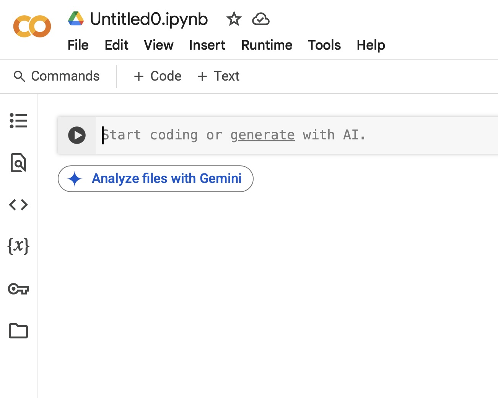
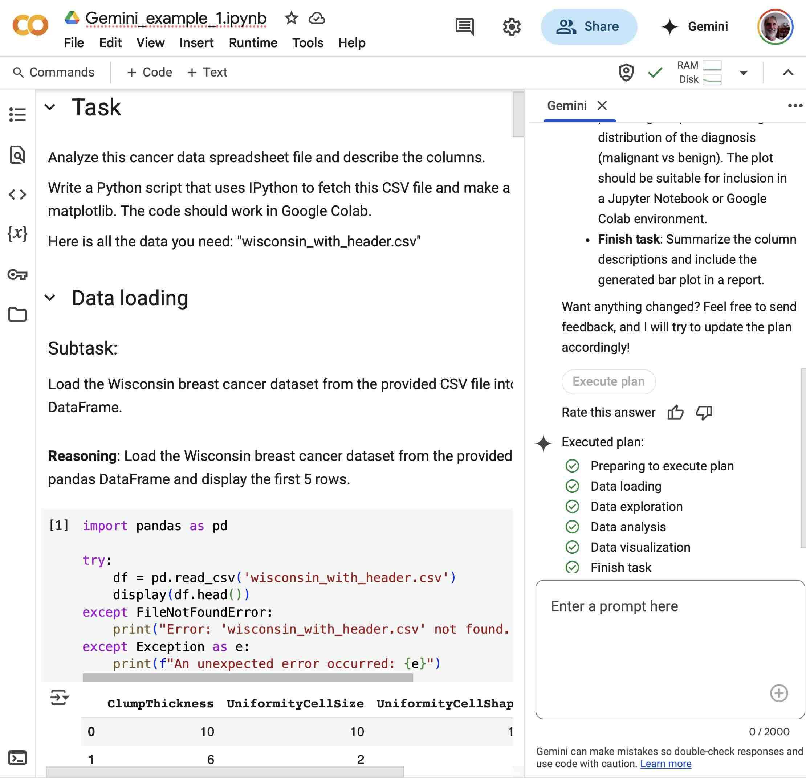
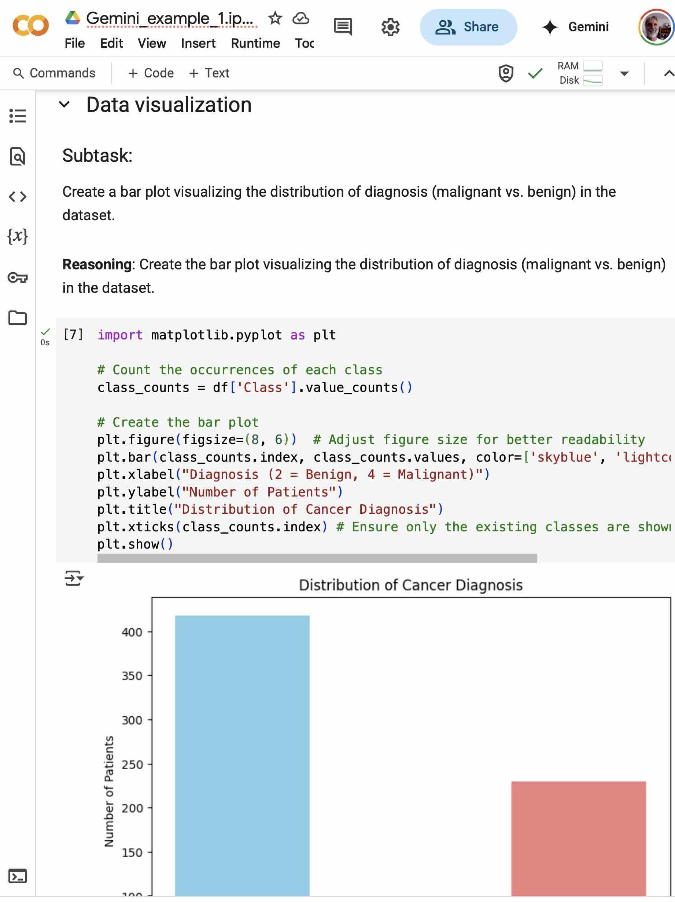

## Using Gemini to Write Python for Google Colab


I made available on the web at URI [https://markwatson.com/data/wisconsin_with_header.csv](https://markwatson.com/data/wisconsin_with_header.csv) a sample CSV file for cancer research. Download this file to your laptop; we will ask Colab to **Analyze files with Gemini** later and use this file for an example.

Prompt:

```text
Analyze this cancer data spreadsheet file and describe the columns.

Write a Python script that uses IPython to fetch this CSV file and make a bar plot of it using matplotlib. The code should work in Google Colab.
```

I will create a new empty Colab notebook and work through an example. Here is the link to the saved notebook:

    https://colab.research.google.com/drive/17EQ0TUCrHg3wWduBWj9KMJPc-9Lp669R?usp=sharing

The empty notebook has the button **Analyze files with Gemini**:



In the next screenshot I uploaded the sample CSV file and used the prompt listed above:



In the following screenshot, I have closed the Gemini window on the right side of the Colab notebook and show example output:



If you look at the linked Colab notebook you will notice that some of the generated analysis code terminated due to runtime errors and Gemini fixed these errors.

## Wrap Up

I use Google Colab notebooks frequently in my work. The example in this chapter demonstrates having Gemini write Python code for you.