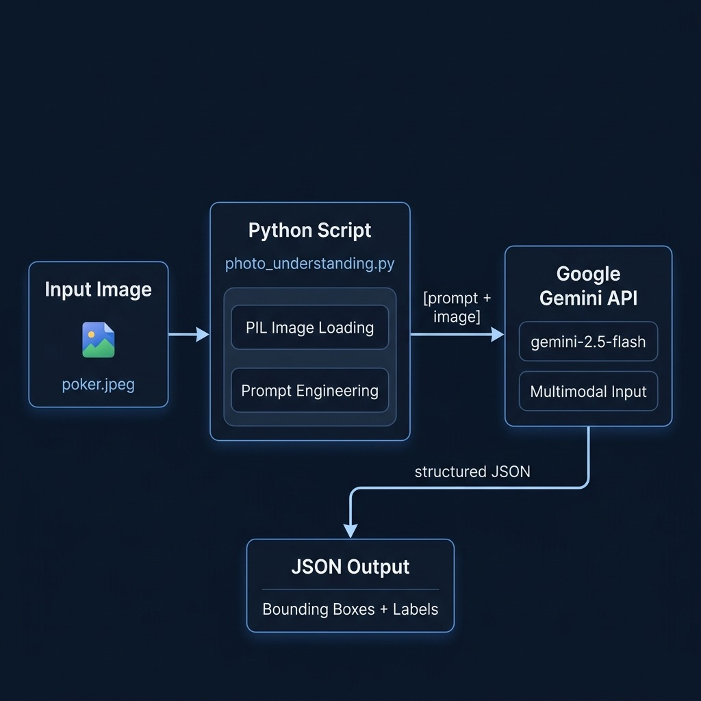

# Using Gemini For Both Images and Text (Multimodal Capabilities)



**Introduction**

In the previous chapters, we explored how to interact with Gemini models using text-based prompts, including leveraging Thinking Mode for complex reasoning tasks. However, one of the significant advancements in modern AI is **multimodality** – the ability of models to process and understand information from multiple types of input simultaneously. Several Gemini models excel at this, allowing you to combine text prompts with images (and potentially other data types like audio or video in the future) in a single request.

This chapter focuses on demonstrating how to use the Gemini Python SDK to send both an image and a text prompt to a capable Gemini model. We will ask the model to analyze the content of the image based on instructions provided in the text prompt. This opens up powerful possibilities for visual question answering, image description, object recognition, and more.

## Prerequisites and Setup

1.  **Multimodal Model:** Ensure the `MODEL_ID` you use corresponds to a Gemini model version that supports image input (e.g., `gemini-1.5-pro`, `gemini-1.5-flash`, or specific preview versions like the one in the example).
2.  **Python Environment:** You need your Python environment set up as discussed in Chapter 2.
3.  **Updated Dependencies:** Image processing requires an additional library, Pillow (a fork of PIL - Python Imaging Library). Your `requirements.txt` file should be updated to include it:

    ```txt
    # requirements.txt
    google-genai
    Pillow
    ```
    * `google-genai`: The Gemini Python SDK, which provides the `genai.Client` interface for interacting with Gemini models.
    * `Pillow`: This library is essential for opening, manipulating, and preparing image files in Python so they can be sent to the model.

    Remember to install or update your dependencies using:
    ```bash
    pip install -r requirements.txt
    ```

## Combining Text and Images in Prompts

The key to sending multimodal input using the Gemini Python SDK lies in how you structure the `contents` argument passed to the `generate_content` method. Instead of passing a single string (like we did for text-only prompts), you pass a **list** where each element represents a different part of the input.

For a text-and-image prompt, this list will typically contain:

1.  The text prompt (as a string).
2.  The image data (often loaded as a `PIL.Image` object).

The SDK handles the necessary encoding and formatting to send both the text instructions and the image pixels to the Gemini API endpoint.

## Example: `photo_understanding.py` - Analyzing an Image

This script demonstrates loading a local image file and sending it along with two different text prompts to a multimodal Gemini model to analyze the people depicted.

*(Please ensure you have an image file located at `../data/poker.jpeg` relative to where you run this script, or modify the `image` path accordingly.)*

```python
# --- Example: Multimodal Input (Image and Text) ---
# Purpose: Send an image and text prompts to Gemini
#          to analyze the image content.

from google import genai
from google.genai import types
from PIL import Image # Used for opening the image file

import os # Used for getting current working directory and API key

# --- Configuration ---
try:
    # 1. Initialize Client
    client = genai.Client(api_key=os.getenv("GOOGLE_API_KEY"))
    if not os.getenv("GOOGLE_API_KEY"):
         raise ValueError("GOOGLE_API_KEY environment variable not set.")

    # 2. Select a Multimodal Model ID
    MODEL_ID="gemini-1.5-flash-preview-04-17"

    # --- First Analysis: General Description and Bounding Boxes ---

    # 3. Define the First Text Prompt
    prompt = """
        Return bounding boxes around people as a JSON array with labels. Never return masks or code fencing. Limit to 10 people.
        Describe each person identified in a picture.
        """

    # 4. Load the Image using Pillow
    # Assumes the image is in ../data relative to the script's CWD
    image_path = os.path.join(os.getcwd(), "..", "data", "poker.jpeg")
    im = Image.open(image_path)

    # 5. Make the First API Call (Image + First Prompt)
    #print(f"\n--- Sending Request 1 (General Description) for image: {image} ---")
    response = client.models.generate_content(
        model=MODEL_ID,
        # Key: Pass prompt and image object together in a list
        contents=[prompt, im],
        # Configuration: Thinking budget set to 0 (minimal/default pre-computation)
        config=types.GenerateContentConfig(
            thinking_config=types.ThinkingConfig(
                thinking_budget=0
            )
        )
    )

    # 6. Print the First Response
    #print("\n--- Response 1 ---")
    if response.parts:
        print(response.text)
    else:
        print("Response 1 was empty or blocked.")
        try:
            print(f"Safety feedback: {response.prompt_feedback}")
        except AttributeError:
            pass # Ignore if feedback isn't available

    # --- Second Analysis: Focus on Hands ---

    # 7. Define the Second, More Specific Text Prompt
    prompt2 = """
        Return bounding boxes around people as a JSON array with labels. Never return masks or code fencing. Limit to 10 people.
        Describe each person identified in a picture, specifically what they are holding in their hands.
        """

    # 8. Make the Second API Call (Image + Second Prompt)
    # Re-uses the loaded image 'im'
    #print("\n--- Sending Request 2 (Focus on Hands) for the same image ---")
    response = client.models.generate_content(
        model=MODEL_ID,
        # Key: Pass the *new* prompt and the *same* image object
        contents=[prompt2, im],
        # Configuration: Same thinking budget setting
        config=types.GenerateContentConfig(
            thinking_config=types.ThinkingConfig(
                thinking_budget=0
            )
        )
    )

    # 9. Print the Second Response
    #print("\n--- Response 2 ---")
    if response.parts:
        print(response.text)
    else:
        print("Response 2 was empty or blocked.")
        try:
            print(f"Safety feedback: {response.prompt_feedback}")
        except AttributeError:
            pass # Ignore if feedback isn't available

except FileNotFoundError:
     print(f"Error: Image file not found at expected path: {image}")
     print("Please ensure the image exists at '../data/poker.jpeg' relative to your script execution directory.")
except ValueError as e:
     print(f"Configuration Error: {e}")
except Exception as e:
    print(f"An error occurred: {e}")

```


**Explanation:**

1.  **Imports:** We import `PIL.Image` for image handling, alongside the Gemini libraries and `os`.
2.  **Client & Model:** Initialization uses `genai.Client` and selects the specified multimodal preview model.
3.  **Prompt 1:** Defines the initial analysis task – identify people, provide bounding boxes in JSON format (with specific negative constraints like "Never return masks or code fencing"), limit the count, and provide descriptions.
4.  **Image Loading:** The script constructs the path to the image file (`../data/poker.jpeg`) relative to the current working directory and uses `Image.open()` from the Pillow library to load it into the `im` variable. Error handling for `FileNotFoundError` is added for robustness.
5.  **API Call 1:** This is the core of the multimodal request.
    * `contents=[prompt, im]`: The text prompt (`prompt`) and the loaded Pillow Image object (`im`) are passed together as a list.
    * `config=...`: Thinking Mode is configured, but `thinking_budget=0` suggests minimal or default pre-computation is requested for this task, prioritizing speed or assuming the task doesn't require extended reasoning time.
6.  **Response 1:** The generated `response.text` should contain the JSON array of bounding boxes and the general descriptions requested.
7.  **Prompt 2:** A new prompt is defined, refining the request to focus specifically on what each person is holding.
8.  **API Call 2:** A second call is made using the *same* loaded image (`im`) but a *new* text prompt (`prompt2`). The structure is identical, demonstrating how you can ask different questions about the same visual input.
9.  **Response 2:** The output text should now contain the bounding boxes and descriptions focused on the objects held by the people in the image.

### Interpreting the Output

Here is the output:

```json
[
  {"box_2d": [198, 438, 394, 628], "label": "people"},
  {"box_2d": [175, 592, 988, 1000], "label": "people"},
  {"box_2d": [257, 734, 530, 876], "label": "people"},
  {"box_2d": [203, 146, 473, 346], "label": "people"},
  {"box_2d": [253, 0, 996, 324], "label": "people"}
]
```
```text
A group of five people are playing poker at a long table. The woman at the top of the table has short white hair and is wearing a red scarf. The man to her left has short gray hair and is smiling. To his left is a man wearing a black baseball cap and a gray sweatshirt. To the right of the woman with white hair is another woman with short brown hair, and to her right is a man with a gray beard and a green shirt.
```
```json
[
  {"box_2d": [198, 437, 387, 627], "label": "a person holding cards"},
  {"box_2d": [254, 0, 1000, 326], "label": "a person holding cards"},
  {"box_2d": [177, 593, 996, 1000], "label": "a person holding cards"},
  {"box_2d": [205, 155, 467, 351], "label": "a person"},
  {"box_2d": [257, 734, 464, 877], "label": "a person"}
]
```


The `response.text` from these calls will contain the model's analysis based on *both* the text instructions and the visual information in `poker.jpeg`. You would expect to see:

* A JSON formatted string representing the bounding boxes for detected people.
* Text descriptions corresponding to each identified person, tailored to the specifics of `prompt` or `prompt2`.

Parsing the JSON and associating it with the descriptions would be the next step in a real application.

## Potential Applications

This ability to process images and text together enables many applications, including:

* **Visual Question Answering (VQA):** Ask specific questions about an image ("What color is the car?", "Are there any animals in this picture?").
* **Image Captioning/Description:** Generate detailed textual descriptions of an image's content.
* **Object Recognition & Analysis:** Identify objects and describe their attributes or relationships ("Describe the furniture in the room.").
* **Data Extraction from Images:** Pull text or structured data from photos of documents, whiteboards, or signs.
* **Image Comparison:** Provide two images and ask the model to describe the differences.

## Wrap Up

Gemini's multimodal capabilities significantly broaden the scope of tasks you can accomplish. By leveraging the Python SDK and libraries like Pillow, you can easily combine text prompts and image data in a single API call. The key is structuring the `contents` parameter as a list containing both your textual instructions and the loaded image object. This allows you to build sophisticated applications that can "see" and reason about visual information based on your specific textual guidance. Remember to use a model that supports multimodal input and include `Pillow` in your project dependencies.
