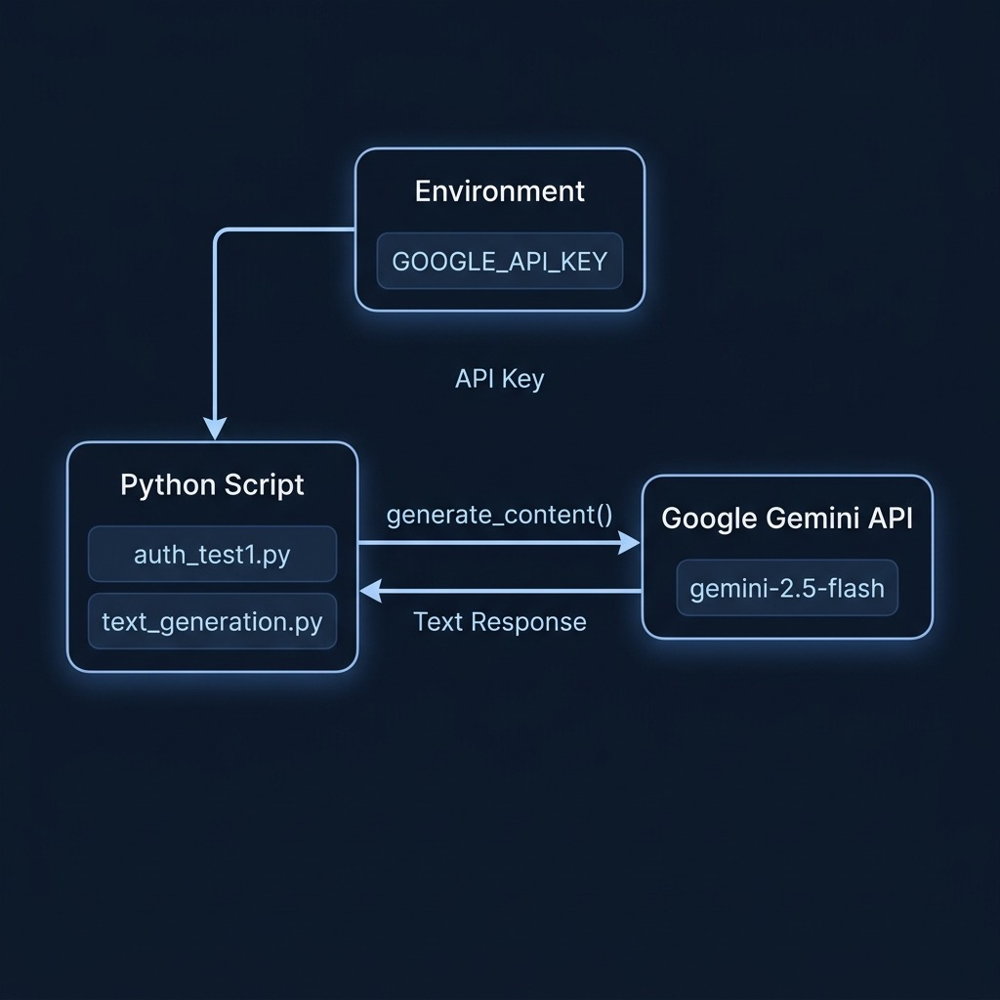

# Authentication and Setup for Google Gemini API



This directory contains two starter scripts that demonstrate how to authenticate with the Google Gemini API and perform basic text generation.

## Prerequisites

- Python 3.10+
- A `GOOGLE_API_KEY` environment variable set with your Google AI API key

Install dependencies:

```bash
pip install -r requirements.txt
```

## Scripts

### `auth_test1.py`

Verifies that your API key is configured correctly by initializing the `genai.Client` and listing all available Gemini models. This is the first script you should run to confirm your setup works.

```bash
python auth_test1.py
```

### `text_generation.py`

A minimal example of generating text with the `gemini-2.5-flash` model. It sends a brainstorming prompt and prints the AI-generated response.

```bash
python text_generation.py
```

## Key Concepts

- **API Key Authentication**: The scripts use `os.getenv('GOOGLE_API_KEY')` to securely load the API key from the environment rather than hardcoding it.
- **Client Initialization**: `genai.Client(api_key=...)` creates a reusable client for all Gemini API interactions.
- **Content Generation**: `client.models.generate_content()` is the core method for sending prompts and receiving AI responses.
