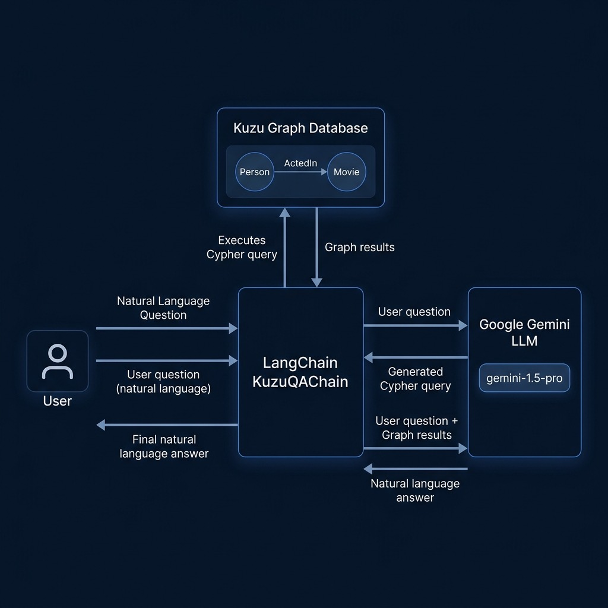

# Knowledge Graph QA with Kuzu, LangChain, and Gemini



This example builds a movie knowledge graph using the [Kuzu](https://kuzudb.com/) embedded graph database, then uses LangChain's `KuzuQAChain` with Google Gemini to answer natural language questions by automatically generating and executing Cypher queries.

Derived from an example in the "Ollama in Action" book.

## Prerequisites

- Python 3.12 (Recommended for Kuzu binary compatibility)
- CMake (Required to build Kuzu extensions, e.g., `brew install cmake` on macOS)
- A `GOOGLE_API_KEY` environment variable set with your Google AI API key

Install dependencies and run with `uv`:

```bash
uv sync
uv run movies_demo.py
```

## Script

### `movies_demo.py`

1. **Cleans up existing database** by removing the `test_db_gemini` path to allow for clean re-runs.
2. **Creates a graph schema** with `Person` and `Movie` nodes connected by `ActedIn` relationships.
3. **Populates the graph** with actors and classic films.
4. **Runs natural language queries** through the `KuzuQAChain` (from `langchain_community`), which:
   - Sends the question to **Gemini 2.0** to generate a Cypher query.
   - Executes the Cypher against the Kuzu database.
   - Sends the results back to Gemini for a natural language answer.


```bash
uv run movies_demo.py
```

### Example Output

```text
> Question: Who acted in The Godfather: Part II?
Generated Cypher:
MATCH (p:Person)-[:ActedIn]->(m:Movie {name: 'The Godfather: Part II'}) RETURN p.name
Full Context:
[{'p.name': 'Al Pacino'}, {'p.name': 'Robert De Niro'}, {'p.name': 'Diane Keaton'}]
< Answer: Al Pacino, Robert De Niro, and Diane Keaton acted in The Godfather: Part II.
```

## Key Concepts

- **Graph Database**: Kuzu provides an embedded, high-performance graph database — no server setup required.
- **LangChain Integration**: `KuzuQAChain` orchestrates the full pipeline from natural language question → Cypher generation → query execution → answer synthesis.
- **Gemini as Cypher Generator**: The LLM translates user questions into valid Cypher queries based on the graph schema, then formulates the answer from query results.
