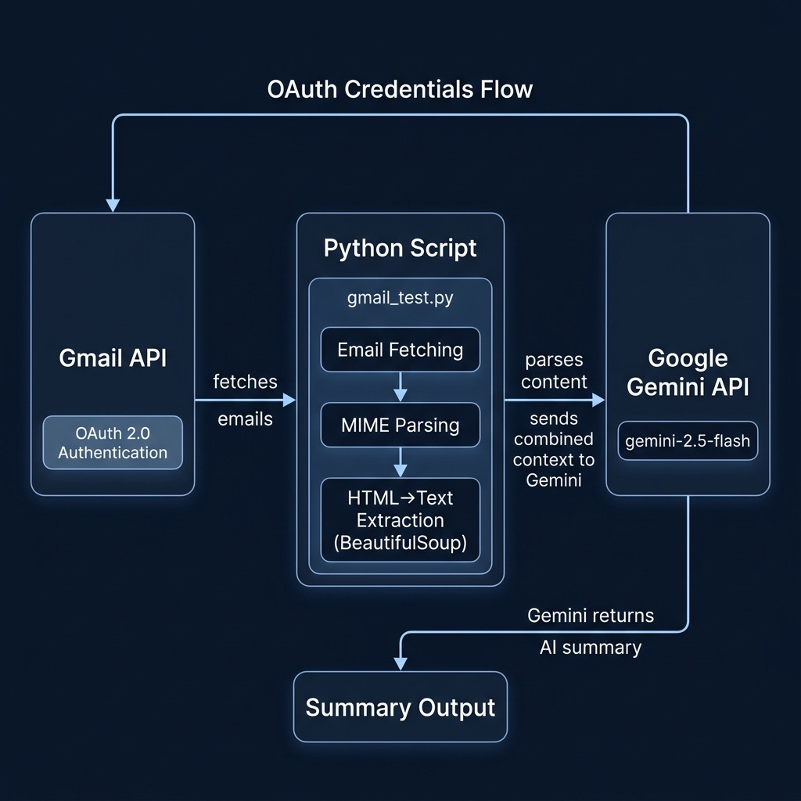

# Using Gemini with Google Apps — Gmail Email Summarization



This directory demonstrates how to combine Google Workspace APIs with Gemini AI to automatically fetch, parse, and summarize your Gmail emails using natural language.

## Prerequisites

- Python 3.10+
- A `GOOGLE_API_KEY` environment variable set with your Google AI API key
- OAuth 2.0 credentials for Google Workspace (see setup instructions below)

Install dependencies:

```bash
pip install -r requirements.txt
```

## Get Credentials to Access Google Apps

Getting the `creds` object is the crucial step for authorizing your Python script to access Google Workspace data (like Gmail, Calendar, etc.) on behalf of a user (which is likely yourself for your solo work). This uses the OAuth 2.0 protocol.

Here is the Google Cloud Console URI:

    https://cloud.google.com/cloud-console/welcome

Create a credential for viewing Gmail data and save to a file **~/.gmail_cred**

### Setup Steps

1. **Enable the API**: Go to the Google Cloud Console → "APIs & Services" → "Library" and enable the Gmail API (and any other APIs you need like Calendar, Drive, Docs).

2. **Create OAuth 2.0 Credentials**:
   - Go to "APIs & Services" → "Credentials"
   - Click "+ CREATE CREDENTIALS" → "OAuth client ID"
   - Configure the OAuth consent screen (select "External" user type for testing)
   - Choose "Desktop app" as the application type
   - Download the credentials JSON file and save it securely

3. **Treat the credentials file like a password** — keep it secure and never commit it to version control.

## Scripts

### `gmail_test.py`

Fetches recent emails matching a search query, extracts their content (handling both plain text and HTML MIME types via BeautifulSoup), combines them into a context window, and sends them to Gemini for summarization.

```bash
python gmail_test.py
```

### `text_generation.py`

A simple Gemini text generation example (same as in `1_start_with_auth_and_setup`) included for reference.

## Key Concepts

- **OAuth 2.0 Authentication**: Required for accessing personal Google Workspace data; uses the `googleapiclient` library to build service objects.
- **MIME Parsing**: Emails come in various formats; the script handles `text/plain` and `text/html` parts, using BeautifulSoup for HTML-to-text extraction.
- **AI Summarization Pipeline**: Raw email content is combined into a single prompt context and sent to Gemini for concise summarization.
