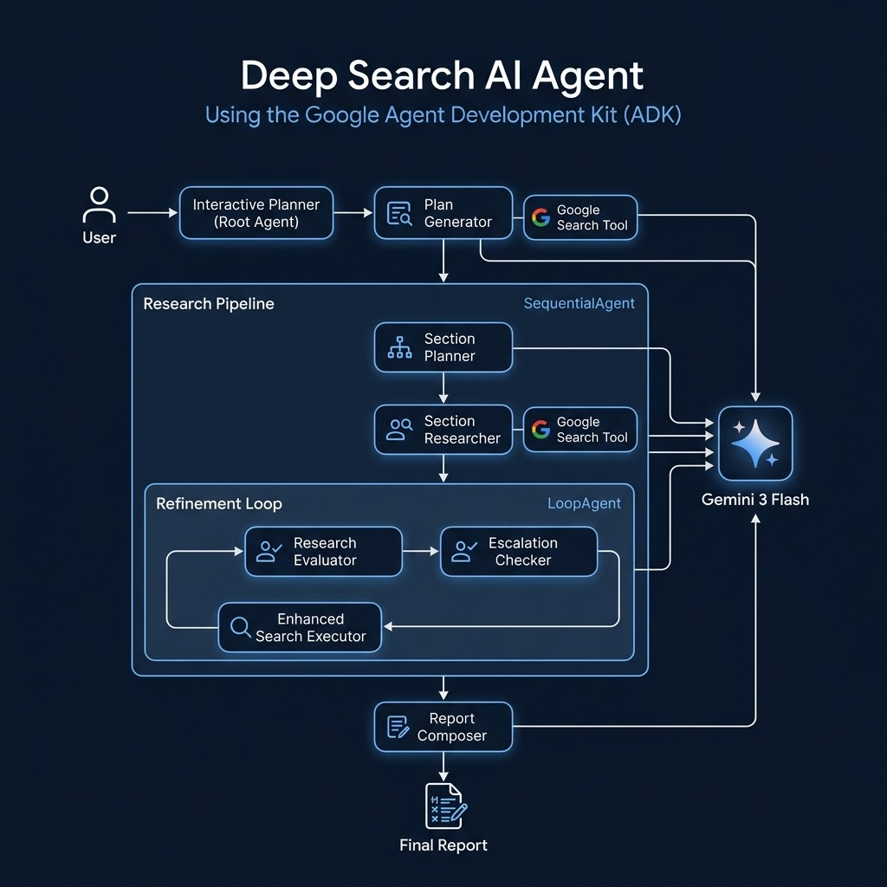

# Deep Search Agent — Google Agent Development Kit (ADK)



This example implements a multi-agent deep research system using the [Google Agent Development Kit (ADK)](https://github.com/google/adk-python). It demonstrates a sophisticated pipeline that plans research, executes web searches, evaluates quality, and produces a cited report — all orchestrated by multiple cooperating AI agents.

Derived from: [google/adk-samples — deep-search](https://github.com/google/adk-samples/tree/main/python/agents/deep-search)

## Prerequisites

- Python 3.10+
- A `GOOGLE_API_KEY` environment variable set with your Google AI API key

Install dependencies (uses `uv`):

```bash
uv sync
```

## Script

### `deep-search.py`

An interactive CLI research assistant. Enter a topic and the system will:

1. **Plan**: The Interactive Planner agent creates a multi-step research plan
2. **Research**: The Section Researcher executes web searches via Google Search
3. **Evaluate**: The Research Evaluator grades the findings and identifies gaps
4. **Refine**: If gaps are found, the Refinement Loop triggers follow-up searches (up to 3 iterations)
5. **Report**: The Report Composer writes a professional report with inline citations

```bash
uv run python deep-search.py
```

## Agent Architecture

The system uses a hierarchy of ADK agent types:

| Agent | Type | Role |
|---|---|---|
| `interactive_planner` | `LlmAgent` (root) | Interfaces with user, manages plan approval |
| `plan_generator` | `LlmAgent` | Creates research plan with `[RESEARCH]` and `[DELIVERABLE]` steps |
| `section_planner` | `LlmAgent` | Designs Markdown report outline (4–6 sections) |
| `section_researcher` | `LlmAgent` | Executes searches and synthesizes findings |
| `research_evaluator` | `LlmAgent` | Grades research quality (pass/fail with feedback) |
| `escalation_checker` | `BaseAgent` | Breaks refinement loop on pass |
| `enhanced_search_executor` | `LlmAgent` | Fills research gaps with targeted follow-up searches |
| `report_composer` | `LlmAgent` | Writes final cited report |

### Pipeline Composition

- **`SequentialAgent`**: Chains section_planner → section_researcher → refinement_loop → report_composer
- **`LoopAgent`**: Iterates evaluator → checker → search_executor (max 3 iterations)

## Key Concepts

- **Multi-Agent Orchestration**: ADK's `SequentialAgent` and `LoopAgent` patterns compose complex workflows from simple, focused agents.
- **Structured Output**: Pydantic models (`SearchQuery`, `Feedback`) enforce typed, validated outputs from LLM agents.
- **Source Tracking**: Grounding metadata from Google Search is collected and converted into inline Markdown citations in the final report.
- **Self-Improving Research**: The evaluate → refine loop ensures comprehensive coverage before report generation.
